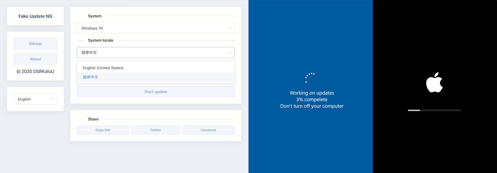

# Fake Update NG

  

Fake Update NG is an experimental open source project built with Vue.js.

It's basically the same concept as [Fake Update](https://fakeupdate.net/), but has a more detailed design with extensible multilingual and theme support.

Note that since this project was created **with the intention of learning Vue**, certain use of tools such as Vuex may be pretty redundant.

Recently working on: Windows 8, Windows 8.1

## Project home page

[GitHub Pages](https://github.amzrk2.cc/fake-update-ng/)

## Screenshots



## Contribute

### Development setup

```bash
npm install    # Install dependencies
npm run serve  # Compiles and hot-reloads for development
npm run build  # Compiles and minifies for production
npm run lint   # Lints and fixes files
```

### Add new translation to home page

Add it in `@/src/locales/home.js`.

### Add new translation to a system

**Note that the translation should be same as the real system upgrade for a better simulation.**

Check the `@/src/locales` folder, find the `json` file of the system you want to modify, then add it in the file.

### Add new system

**Note that the styles should be same as the real system upgrade for a better simulation.**

All files needed:

```bash
@/index.js # System data
@/locales/[...].json # Locale data, {} for no need
@/router/systems.js # Router to the system
@/systems/[...].vue # System page design
```

You can check the `@/systems/windows-10.vue` as a template.

## 📝 License

All system page designs and graphics are from the Internet.

This project and all contributors shall not be responsible for any dispute or loss caused by using this project.

This project is released under the `Apache License 2.0`, for more information read the [License](https://github.com/amzrk2/hugo-theme-fuji/blob/master/LICENSE).

> © 2020 DSRKafuU(amzrk2) [Twitter @amzrk2](https://twitter.com/amzrk2) [GitHub @amzrk2](https://github.com/amzrk2)

## Data sources

- Theme design: <https://vercel.com/> and <https://blog.skk.moe/>
- Apple logo: <https://github.com/gilbarbara/logos/blob/master/logos/apple.svg>
